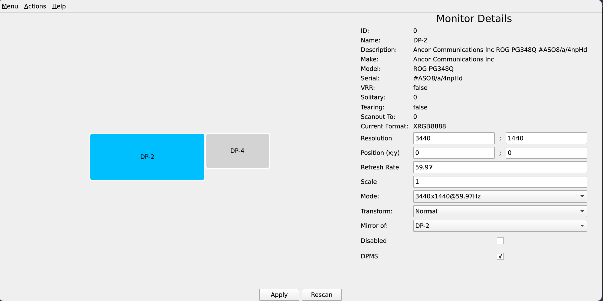

# HyprView

[](https://app.deepsource.com/gh/fabelv/HyprView/)
[](https://app.deepsource.com/gh/fabelv/HyprView/)
[](https://app.deepsource.com/gh/fabelv/HyprView/)

[](https://sonarcloud.io/summary/new_code?id=fabelv_HyprView)
[](https://sonarcloud.io/summary/new_code?id=fabelv_HyprView)
[](https://sonarcloud.io/summary/new_code?id=fabelv_HyprView)
[](https://sonarcloud.io/summary/new_code?id=fabelv_HyprView)

---

**HyprView** is a Qt-based monitor layout manager for [Hyprland](https://github.com/hyprwm/Hyprland).  
Easily visualize and configure multi-monitor setups with a modern UI.

<p align="center">
  
</p>

---

## Try out Tool
```
nix run github:fabelv/HyprView
```

---

## Setup

```bash
git clone https://github.com/fabelv/HyprView.git
cd HyprView
nix develop
make
```

That's it — the project will be built and ready to run!

To launch:
```bash
./build/hyprview
```

---

## Project Structure

- `src/` - Main application logic
- `lib/` - Core components (logic, models, managers)
- `include/` - Header files
- `test/` - Unit and integration tests
- `res/` - Assets like images and QML resources
- `flake.nix` / `shell.nix` - Nix Flake setup for reproducible dev environments
- `CMakeLists.txt` - Build configuration

---

## Dev Tools

- Qt 6
- C++23
- CMake + Ninja
- GoogleTest for unit testing
- Clangd + `compile_commands.json` for IDE support
- DeepSource & SonarCloud for static analysis

---

## CI & Quality Checks

GitHub Actions runs:
- Build & test
- Static analysis with cppcheck & clang-tidy
- Code coverage reports (optional)

See `.github/workflows/ci.yaml` for details.

---

## Testing

To run tests locally:
```bash
make test
```

---


